<h2>⚡ Energy Balance System (SIBAE)</h2>

  <strong>SIBAE</strong> (<em>Sistema de Balance de Energía</em>) is a backend-driven platform developed for the <strong>Federal Electricity Commission (CFE)</strong>, specifically within the Department of Engineering, Connections, and Services.  
  The system was designed to automate critical energy balance and reporting processes that were previously managed manually, improving efficiency, accuracy, and operational visibility.

<h3>🏗️ Context</h3>

  Before SIBAE’s implementation, energy balance operations required manual data processing and validation, leading to frequent inconsistencies, delayed decision-making, and limited traceability.  
  The need for automation and reliability motivated the development of a centralized system capable of managing energy data in real time.

<h3>💻 Technical Overview</h3>

  SIBAE was built with <strong>Laravel</strong> and <strong>MySQL</strong>, using a modular architecture and event-driven backend logic.  
  Database triggers were implemented to automate core processes, ensuring data consistency and reducing human error.  
  The architecture was designed to be scalable, maintainable, and ready for future integrations with other CFE digital systems.

<h3>🔧 Key Features</h3>
<ul>
  <li>Modular and scalable architecture built on <strong>Laravel</strong></li>
  <li>Automated energy calculations and validations via <strong>MySQL triggers</strong></li>
  <li>Role-based access control and audit-ready data management</li>
  <li>RESTful API structure for potential third-party integrations</li>
  <li>Scrum-based development with continuous communication with stakeholders</li>
</ul>

<h3>🚀 Impact</h3>

  SIBAE streamlined critical workflows, reduced manual effort, and improved data reliability across the department.  
  The system established a technical foundation for future digital transformation initiatives and served as a reference model for automation within institutional energy management.

<h3>👥 Team & Methodology</h3>

  Led a multidisciplinary development team under the <strong>Scrum</strong> framework — defining sprints, deliverables, and review sessions with CFE’s technical staff.  
  Contributed to backend architecture design, API development, functional testing, and technical documentation.

<h2>🧮 System Overview</h2>

This section presents the core functionalities and visual components of the Energy Balance System (SIBAE), developed to streamline and automate energy data management.

<h3>📌 System Entry Point</h3>

The initial interface provides access to key modules and user navigation. It sets the foundation for operational workflows.

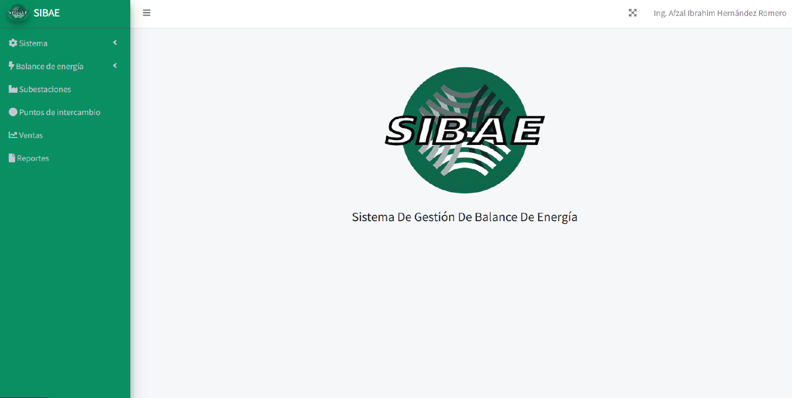

<h3>⚡ Annual High Voltage Energy Balance</h3>

This module displays the yearly energy balance for high-voltage systems, offering insights into consumption and distribution patterns.

<h3>📊 Related Graphs and Visual Analytics</h3>

These charts (images 3 to 6) visualize energy metrics, trends, and comparative data to support technical analysis and decision-making.

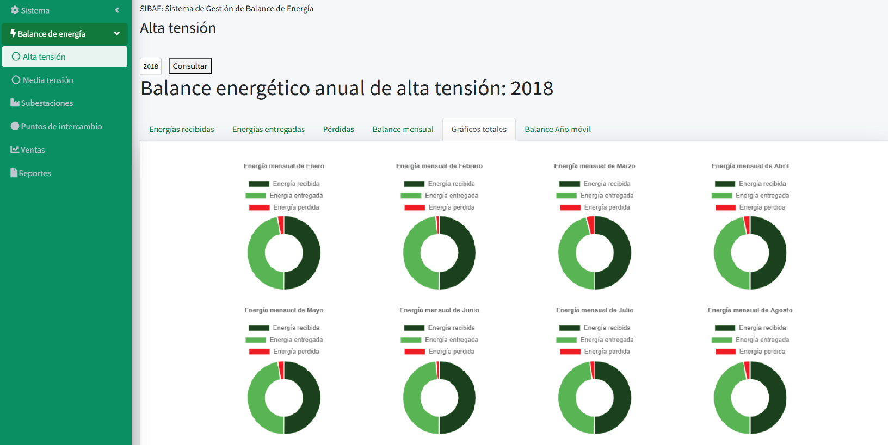
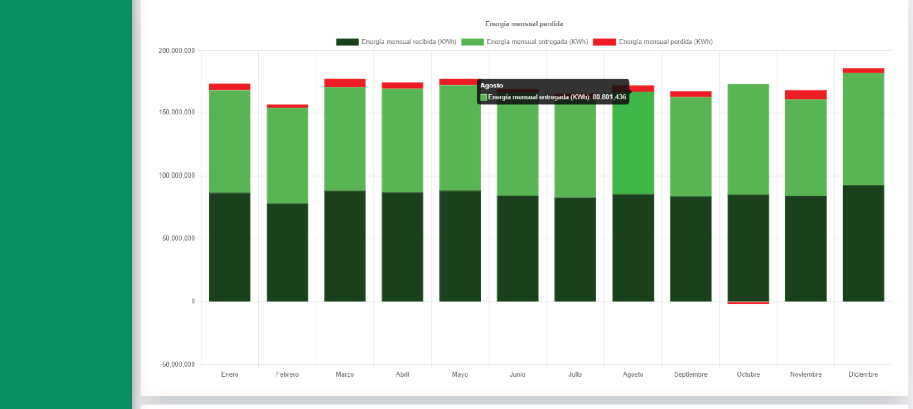
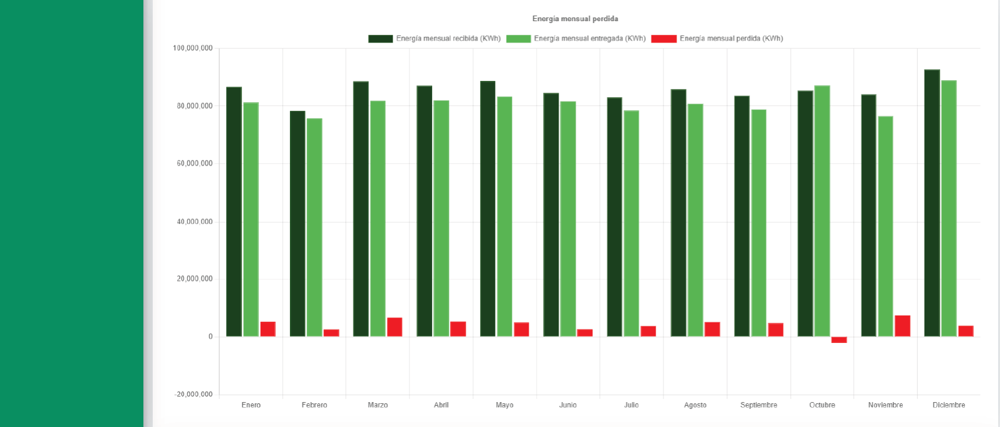
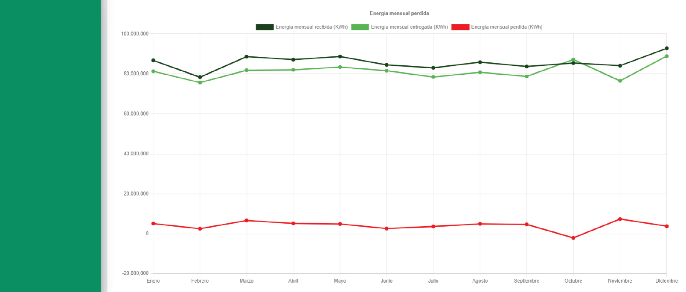

<h3>🔍 Energy Losses Overview</h3>

This section highlights areas of energy loss, helping identify inefficiencies and opportunities for system optimization.

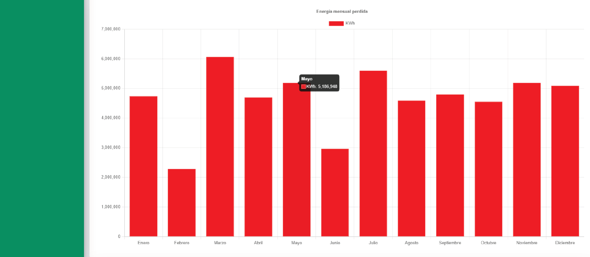

<h3>📈 Annual Energy Graphs</h3>

Images 8 and 9 present annual performance metrics, showcasing consumption trends and operational benchmarks.

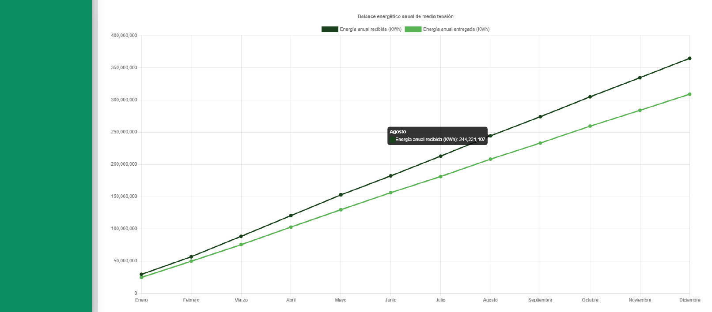
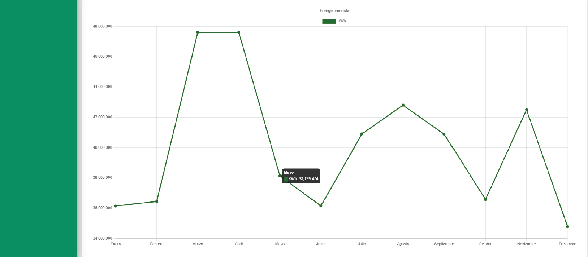

<h3>⚙️ System Configuration Panel</h3>

This interface allows administrators to manage system parameters, user roles, and operational settings.

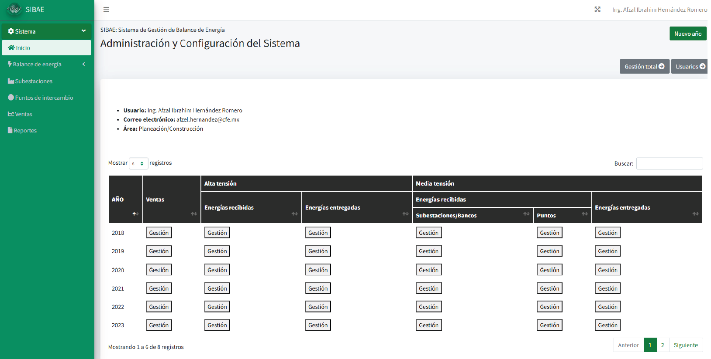

<h3>🧵 Substation Single-Line Diagrams</h3>

Images 11 and 12 illustrate the electrical layout of substations, supporting infrastructure planning and diagnostics.

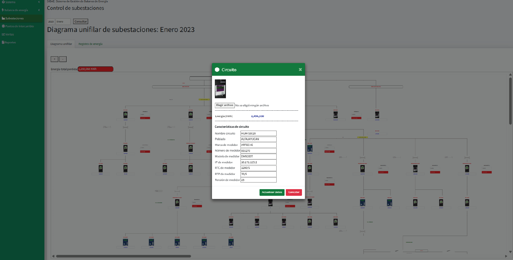
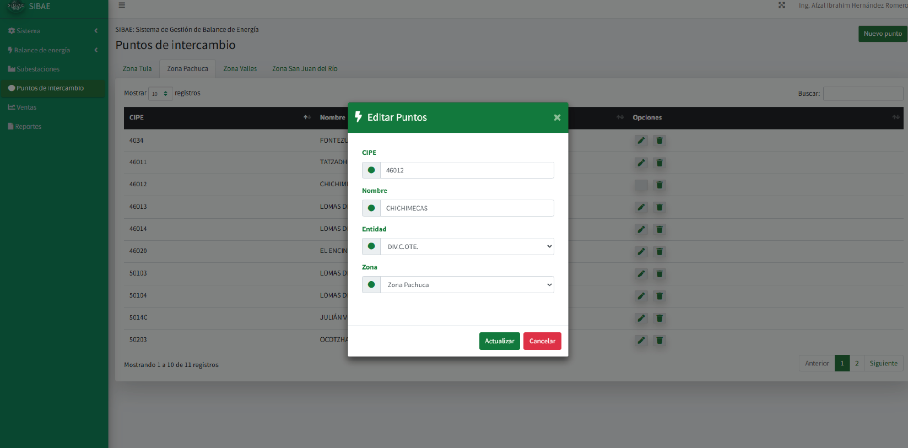

<h3>💼 Sales Management Module</h3>

This module facilitates tracking and analysis of energy sales, integrating commercial data with technical metrics.

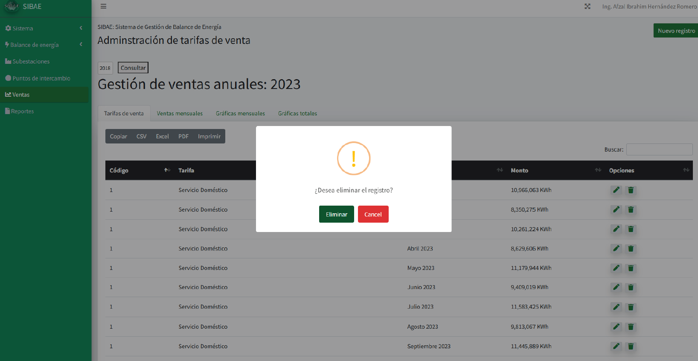

<h3>📚 Historical Records</h3>

The final section provides access to historical energy data, enabling audits, reporting, and long-term analysis.

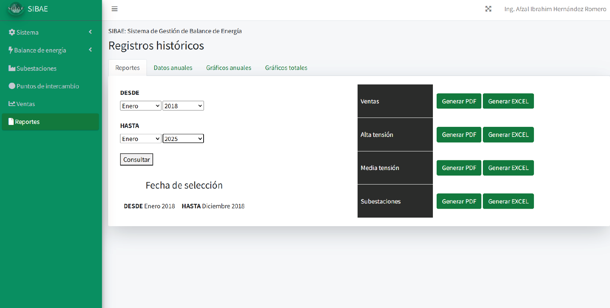

## About Laravel

Laravel is a web application framework with expressive, elegant syntax. We believe development must be an enjoyable and creative experience to be truly fulfilling. Laravel takes the pain out of development by easing common tasks used in many web projects, such as:

- [Simple, fast routing engine](https://laravel.com/docs/routing).
- [Powerful dependency injection container](https://laravel.com/docs/container).
- Multiple back-ends for [session](https://laravel.com/docs/session) and [cache](https://laravel.com/docs/cache) storage.
- Expressive, intuitive [database ORM](https://laravel.com/docs/eloquent).
- Database agnostic [schema migrations](https://laravel.com/docs/migrations).
- [Robust background job processing](https://laravel.com/docs/queues).
- [Real-time event broadcasting](https://laravel.com/docs/broadcasting).

Laravel is accessible, powerful, and provides tools required for large, robust applications.

## Learning Laravel

Laravel has the most extensive and thorough [documentation](https://laravel.com/docs) and video tutorial library of all modern web application frameworks, making it a breeze to get started with the framework.

You may also try the [Laravel Bootcamp](https://bootcamp.laravel.com), where you will be guided through building a modern Laravel application from scratch.

If you don't feel like reading, [Laracasts](https://laracasts.com) can help. Laracasts contains thousands of video tutorials on a range of topics including Laravel, modern PHP, unit testing, and JavaScript. Boost your skills by digging into our comprehensive video library.

## Laravel Sponsors

We would like to extend our thanks to the following sponsors for funding Laravel development. If you are interested in becoming a sponsor, please visit the [Laravel Partners program](https://partners.laravel.com).

### Premium Partners

- **[Vehikl](https://vehikl.com/)**
- **[Tighten Co.](https://tighten.co)**
- **[WebReinvent](https://webreinvent.com/)**
- **[Kirschbaum Development Group](https://kirschbaumdevelopment.com)**
- **[64 Robots](https://64robots.com)**
- **[Curotec](https://www.curotec.com/services/technologies/laravel/)**
- **[Cyber-Duck](https://cyber-duck.co.uk)**
- **[DevSquad](https://devsquad.com/hire-laravel-developers)**
- **[Jump24](https://jump24.co.uk)**
- **[Redberry](https://redberry.international/laravel/)**
- **[Active Logic](https://activelogic.com)**
- **[byte5](https://byte5.de)**
- **[OP.GG](https://op.gg)**

## Contributing

Thank you for considering contributing to the Laravel framework! The contribution guide can be found in the [Laravel documentation](https://laravel.com/docs/contributions).

## Code of Conduct

In order to ensure that the Laravel community is welcoming to all, please review and abide by the [Code of Conduct](https://laravel.com/docs/contributions#code-of-conduct).

## Security Vulnerabilities

If you discover a security vulnerability within Laravel, please send an e-mail to Taylor Otwell via [taylor@laravel.com](mailto:taylor@laravel.com). All security vulnerabilities will be promptly addressed.

## License

The Laravel framework is open-sourced software licensed under the [MIT license](https://opensource.org/licenses/MIT).

