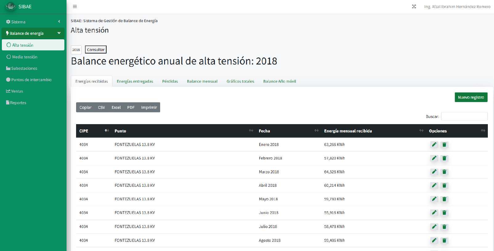

<h2>🧮 Energy Balance System (SIBAE)</h2>

  <strong>SIBAE</strong> is a backend-driven solution built with <strong>Laravel</strong> and <strong>MySQL</strong> to automate critical energy balance processes within institutional environments.
  The system features a modular architecture and custom backend logic, including database triggers to ensure operational efficiency and data reliability.

<h3>🔧 Key Features:</h3>
<ul>
  <li>Scalable, modular architecture using Laravel</li>
  <li>Automated energy calculations via MySQL triggers</li>
  <li>Agile development workflow with Scrum methodology</li>
  <li>Clear communication with technical stakeholders</li>
  <li>Solid foundation for future integrations and enhancements</li>
</ul>

<h3>🚀 Impact:</h3>

  The system streamlined operational workflows, reduced manual effort, and improved traceability of energy data across the department.

<h2>🧮 System Overview</h2>

This section presents the core functionalities and visual components of the Energy Balance System (SIBAE), developed to streamline and automate energy data management.

<h3>📌 System Entry Point</h3>

The initial interface provides access to key modules and user navigation. It sets the foundation for operational workflows.

<h3>⚡ Annual High Voltage Energy Balance</h3>

This module displays the yearly energy balance for high-voltage systems, offering insights into consumption and distribution patterns.

<h3>📊 Related Graphs and Visual Analytics</h3>

These charts (images 3 to 6) visualize energy metrics, trends, and comparative data to support technical analysis and decision-making.

<h3>🔍 Energy Losses Overview</h3>

This section highlights areas of energy loss, helping identify inefficiencies and opportunities for system optimization.

<h3>📈 Annual Energy Graphs</h3>

Images 8 and 9 present annual performance metrics, showcasing consumption trends and operational benchmarks.

<h3>⚙️ System Configuration Panel</h3>

This interface allows administrators to manage system parameters, user roles, and operational settings.

<h3>🧵 Substation Single-Line Diagrams</h3>

Images 11 and 12 illustrate the electrical layout of substations, supporting infrastructure planning and diagnostics.

<h3>💼 Sales Management Module</h3>

This module facilitates tracking and analysis of energy sales, integrating commercial data with technical metrics.

<h3>📚 Historical Records</h3>

The final section provides access to historical energy data, enabling audits, reporting, and long-term analysis.

  <strong>SIBAE</strong> is a backend-driven solution built with <strong>Laravel</strong> and <strong>MySQL</strong> to automate critical energy balance processes within institutional environments.
  The system features a modular architecture and custom backend logic, including database triggers to ensure operational efficiency and data reliability.

<h3>🔧 Key Features:</h3>
<ul>
  <li>Scalable, modular architecture using Laravel</li>
  <li>Automated energy calculations via MySQL triggers</li>
  <li>Agile development workflow with Scrum methodology</li>
  <li>Clear communication with technical stakeholders</li>
  <li>Solid foundation for future integrations and enhancements</li>
</ul>

<h3>🚀 Impact:</h3>

  The system streamlined operational workflows, reduced manual effort, and improved traceability of energy data across the department.

